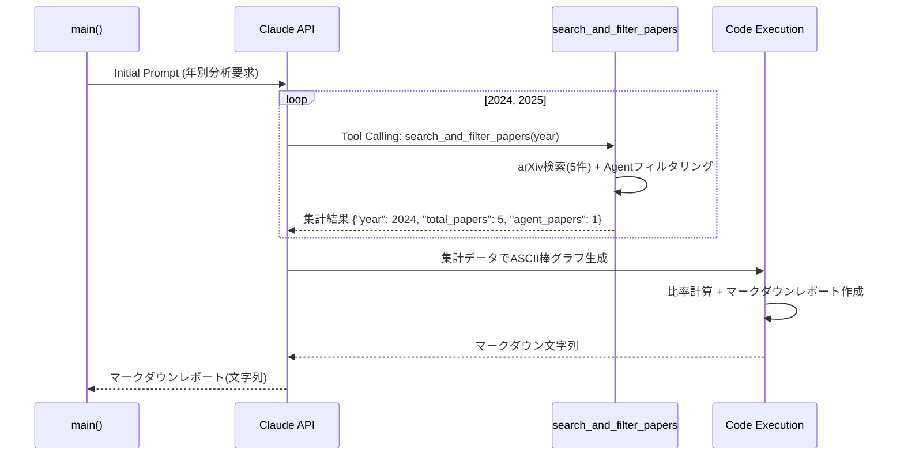

# Arxiv論文トレンド分析システム

このリポジトリは、2023-2025年のarxiv論文（生成AI関連）を検索し、ClaudeのProgrammatic Tool Calling (PTC) 機能を使って自動的に要約・傾向分析を行うシステムです。

## 概要

### 目的
- 生成AI分野の研究トレンドを年次別に分析
- 主要なトピック・技術トレンドの抽出
- 注目すべき論文の特定
- 技術的進化の方向性の把握

### 主な特徴
- **Programmatic Tool Calling (PTC)**: Claude最新のAdvanced Tool Use機能を活用
- **自動データ取得**: Arxiv APIを使用した論文検索
- **包括的なログ出力**: デバッグと監視のための詳細ログ
- **効率的な処理**: トークン使用量を最適化した設計

## システム構成

### 役割分担
- **Arxiv検索ツール**: 年次・カテゴリ別の論文データ取得
- **Claude (PTC)**: 論文要約、年次傾向分析、インサイト抽出
- **コード実行環境**: Claudeがプログラマティックに使用

### 技術スタック
- **Python 3.10+**
- **Anthropic Claude Sonnet 4.5**
- **Arxiv Python Library**
- **Advanced Tool Use Beta機能**

## システム構成フロー

```mermaid
flowchart TD
    A[main()] --> B[run_analysis()]
    B --> C[Claude API Client 初期化]
    C --> D[Tools定義]
    D --> E[Initial Prompt送信]
    
    E --> F[Claude Response処理]
    F --> G{Response Type}
    
    G -->|tool_use| H[Tool実行]
    G -->|server_tool_use| I[Server Tool実行]
    G -->|end_turn| J[終了処理]
    
    H --> K{Tool Type}
    K -->|search_arxiv_papers| L[arXiv検索]
    K -->|save_output_md| M[ファイル保存]
    
    L --> N[arxiv.Client().results()]
    N --> O[論文データ取得]
    O --> P[JSON形式で返却]
    P --> Q[Claudeに結果送信]
    
    M --> R[/tmp/output.md読み込み]
    R --> S[output.md書き込み]
    S --> T[保存完了]
    
    I --> U[Code Execution]
    U --> V[numpy.histogram実行]
    V --> W[ASCIIヒストグラム生成]
    W --> X[/tmp/output.md保存]
    
    Q --> F
    T --> F
    X --> F
    
    J --> Y[Fallback保存処理]
    Y --> Z[output.md作成]
    
    style A fill:#e1f5fe
    style L fill:#f3e5f5
    style M fill:#e8f5e8
    style U fill:#fff3e0
    style Y fill:#ffebee
```

## データフロー



## ツール詳細

### search_and_filter_papers (Function Calling)
- **Tool Calling**: Claudeから間接的に呼び出しされるCustom Tool
- arXiv API経由でcs.AI論文を全件検索 + Agentフィルタリングをローカル実行
- 年別検索 (2024-2025年、各年5件)
- 内部でAgentキーワードマッチングでフィルタリング
- 集計結果のみ返却 {"year": 2024, "total_papers": 5, "agent_papers": 1}
- **トークン最適化**: 大量論文データはClaudeコンテキストに残さない

### Code Execution (Server Tool)
- Claude推論モデルから集計データ + Pythonコードを受信
- 年別比率計算・経年変化分析
- ASCII棒グラフをコード実行で生成
- マークダウン形式で分析レポート出力
- **軽量処理のみ**: 大量データ処理は行わない

### main()関数でのファイル保存
- Claudeからマークダウン文字列を受け取り
- main()関数内で直接output.mdに保存
- シンプルで明示的なファイル処理

## 保存メカニズム

**main()関数での直接保存**: マークダウン結果をoutput.mdに保存
- run_analysis()がマークダウン文字列を返却
- main()関数で直接output.mdファイルに書き込み
- シンプルで明確なファイル処理フロー

## セットアップ

### 必要な環境
```bash
# Python 3.10以上
python --version

# 依存関係インストール
pip install -r requirements.txt
```

### 環境変数設定
```bash
# .envrcファイル作成
echo 'export ANTHROPIC_API_KEY="your-api-key-here"' > .envrc
direnv allow
```

## 使用方法

### 基本実行
```bash
python arxiv_trend_analyzer.py
```

### 実行結果
- **コンソール出力**: リアルタイムログとデバッグ情報
- **ログファイル**: `arxiv_analyzer.log`
- **分析レポート**: `arxiv_analysis_YYYYMMDD_HHMMSS.md`

## 出力例

```markdown
# 生成AI研究トレンド分析 (2023-2025)

## 2023年の傾向
### 主要トピック
1. Large Language Modelsの性能向上
2. Diffusion Modelsの画像生成
...

### 注目論文
- [論文タイトル](arxiv_link) - 概要

## 年次比較
- 2023→2024: LLMの実用化加速
- 2024→2025: マルチモーダルAIの出現
```

## 設定可能項目

### 検索パラメータ
- **年次範囲**: 2023-2025（変更可能）
- **論文数**: デフォルト5件/年
- **カテゴリ**: cs.AI, cs.LG, cs.CL
- **キーワード**: "generative AI", "LLM", "ChatGPT", "GPT-4"

### APIパラメータ
- **max_tokens**: 8192
- **model**: claude-sonnet-4-5-20250929
- **beta機能**: advanced-tool-use-2025-11-20

## ログ出力

### ログレベル
- **INFO**: 基本的な実行フロー
- **DEBUG**: 詳細なデバッグ情報
- **ERROR**: エラー情報とスタックトレース

### ログ出力先
- **コンソール**: リアルタイム表示
- **ファイル**: `arxiv_analyzer.log`

## 新アーキテクチャの特徴

### PTC (Programmatic Tool Calling) の活用
1. **search_arxiv_papers**: 従来のFunction Calling同様、ローカルで重い検索処理
2. **Code Execution**: Claude推論モデルが動的にPythonコードを生成・実行
3. **柔軟な分類**: 固定キーワードではなく、自然言語による文脈理解

### データフローの最適化
```
大量論文データ → search_and_filter_papers (Tool Calling/ローカルフィルタリング) → 集計結果 {year, total_papers, agent_papers} → Claude推論モデル → Code Execution
```

### トークン効率
- **Heavy Lifting**: search_and_filter_papersツールで検索+フィルタリングをローカル一括処理
- **Light Processing**: Code Executionで集計データのみ可視化
- Claude推論モデルは集計結果のみ受信、トークン消費最小化
- 200件×6年でもスケール可能

## トラブルシューティング

### よくある問題

1. **APIキーエラー**
   ```
   ValueError: ANTHROPIC_API_KEY environment variable not set
   ```
   → `.envrc`ファイルでAPIキーを設定

2. **Max Tokens到達**
   ```
   stop_reason: max_tokens
   ```
   → abstractの文字数制限やmax_tokensの調整

3. **Arxiv検索エラー**
   ```
   Error searching arxiv for year XXXX
   ```
   → ネットワーク接続とrate limitを確認

## ライセンス

MIT License

## 貢献

Issues やPull Requestsを歓迎します。

## 参考資料

- [Anthropic Advanced Tool Use Documentation](https://platform.claude.com/docs/en/agents-and-tools/tool-use/programmatic-tool-calling)
- [Arxiv API Documentation](https://arxiv.org/help/api/index)
- [Claude Engineering Blog - Advanced Tool Use](https://www.anthropic.com/engineering/advanced-tool-use)